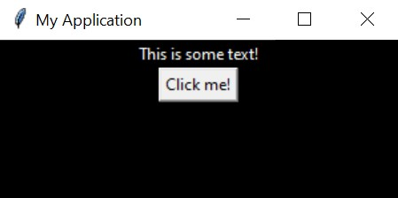

# tks (tkinter superset) *
## Disclaimers
* This project was written in Python version 3.10 and has yet to be tested with earlier versions of the language.
* Developers using WSL may encounter issues stemming from their `DISPLAY` environment variable. The author has yet to find a solution to this problem.

## Table of Contents
1. [Getting Started](#getting-started)
2. [Example Project](#example-project)
3. Pure API Documentation (Under construction)

## Getting Started
### Installation
First, make sure you have a compatible version of Python installed along with tkinter. The author also recommends using a virtual environment when following this guide.

Run the following command:
```
python -m pip install git+https://github.com/piccoloser/tks.git
```

If you don't get any errors, tks should be successfully installed.

## Example project
*This section will disregard comparisons to tkinter's syntax in favor of being concise.*

Let's create a project folder and within it add a new Python file called `main.py`, then paste the following code.
```python
# main.py

import tkinter as tk
import tks


def main():
    root = tks.Window("My Application")
    root.mainloop()


if __name__ == "__main__":
    main()

```

Running this script will open the following window:


To add a new text label to this window, we'll use the `add` method **before** `root.mainloop()`.

```python
# main.py
# ...

root = tks.Window("My Application")

root.add(tk.Label, text="This is some text!")

root.mainloop()

# ...
```

Now the window should display some text.


A major feature of tks is the ability to style widgets with Cascading Style Sheets (CSS), a language used heavily in the world of web design for the purpose of describing how HTML elements look.

Let's create another file in our project folder and name it `style.css`. In this file, paste the following:

```css
Window {
    background: black;
    width: 300;
    height: 120;
}

Label {
    background: black;
    color: white;
}
```

Now in `main.py`, **above** where we defined our window, we'll add a line for the stylesheet, and pass it to `root` as an argument:

```python
# main.py
# ...

stylesheet = tks.Stylesheet("./style.css")
root = tks.Window("My Application", stylesheet)

# ...
```

The window should now appear with a black background and white text.


We use a relative path `./style.css` to refer to our new CSS file. This path is validated using `pathlib` and the file contents are automatically parsed into usable Python code as soon as we create the `tks.Stylesheet`.

Next, let's change the color of our text when the user clicks a button. First, we'll add the button itself...

```python
# main.py
# ...

root.add(tk.Label, text="This is some text!")

my_button = root.add(tk.Button, text="Click me!")

# ...
```

*Notice how in order to reference our element (in this case, a button) we need only assign it to a variable.*

Then, we'll assign our label to a variable so it can be referenced in our function...

```python
# main.py
# ...

my_label = root.add(tk.Label, text="This is some text!")

# ...
```

Then, we'll add the actual functionality to our button. Here's the full code snippet:

```python
import tkinter as tk
import tks


def change_color(label, color):
    """Change the foreground (fg) color of a given label."""
    label.configure(fg=color)


def main():
    stylesheet = tks.Stylesheet("./style.css")
    root = tks.Window("My Application", stylesheet)

    my_label = root.add(tk.Label, text="This is some text!")

    root.add(
        tk.Button,
        text="Click me!",
        command=lambda: change_color(my_label, "cyan"),
    )

    root.mainloop()
    

if __name__ == "__main__":
    main()

```

*Explaining the use of `lambda` in the declaration of our button is beyond the scope of this guide. Please refer to this [W3Schools](https://www.w3schools.com/python/python_lambda.asp) page for more details about lambda functions.*

Here's what the result looks like:



Great! Clicking this button will change the color of our text from white to cyan. Now let's add some styling to the button:

```css
/* main.css */
/* ... */

Button {
    background: blue;
    color: white;
    border-style: flat /* tkinter equivalent of "solid" */
}

/* ... */
```

Now you'll see that the button is blue with white text and a solid border.


Before wrapping up this guide, we can reduce repetition in our CSS by using variables. In CSS, variables are defined using a selector called `:root` and referenced using the `var()` function.

Update your CSS such that it matches the following:

```css
/* CSS variables must begin with double hyphens. */
:root {
    --background: #000; /* You can use hex values as well. */
    --foreground: #fff;
    --blue: #00f;
}

Window {
    background: var(--background);
    width: 300;
    height: 120;
}

Button {
    background: var(--blue);
    color: var(--foreground);
    border-style: flat;
}

Label {
    background: var(--background);
    color: var(--foreground);
}
```

*Running the program after making these changes will display the exact same window.*

This way, we can update items that share those variables without having to change each and every one of them.

**Congratulations**, you've created your first program using tks!
